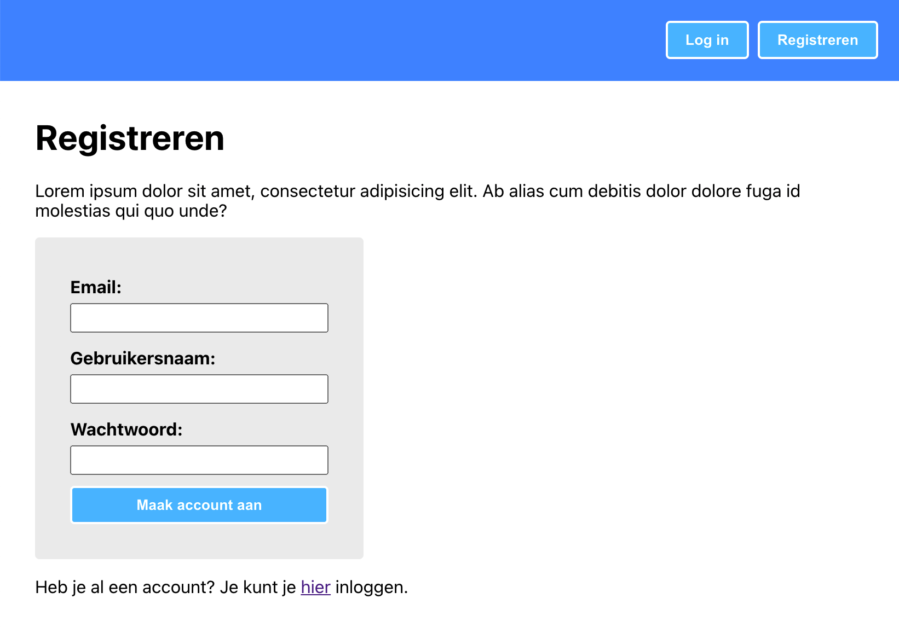

# Opdrachtbeschrijving

## Inleiding
Tot nu waren al jouw apps openlijk toegankelijk en daar ga je nu maar eens verandering in brengen. Het is tijd om authenticatie te implementeren! Dit kun je doen met behulp van jouw eigen project, of door dit project als basis te gebruiken.

Dit project bevat vier pagina's met routing:
* Home pagina - bereikbaar op `/`
* Profiel pagina - bereikbaar op `/profile`
* Registratiepagina (met daarop een react-hook-form registratieformulier) - bereikbaar op `/signup`
* Inlog pagina (met daarop een react-hook-form inlog-formulier) - bereikbaar op `/signin`

Om het gebruik van een backend te veinsen, gebruiken we een nep database server. Dit is niets meer dan een javascript projectje die zich, doormiddel van een npm package genaamd `json-server-auth`, gedraagt als een backend met REST endpoints wanneer je het project runt. 
Je kunt deze nep-server [hier](https://github.com/hogeschoolnovi/frontend-fake-server) clonen. In de README staat beschreven hoe je de server kunt starten en welke endpoints er beschikbaar zijn.

## De applicatie starten
_Let op_: zorg eerst dat je de nep-server hebt draaien voor je deze applicatie start.

Als je het project gecloned hebt naar jouw locale machine, installeer je eerst de node_modules door het volgende commando in de terminal te runnen:

`npm install`

Wanneer dit klaar is, kun je de applicatie starten met behulp van:

`npm start`

of gebruik de WebStorm knop (npm start). Open http://localhost:3001 om de pagina in de browser te bekijken. Elke keer als je een bestand opslaat, zullen de wijzigingen te zien zijn op de webpagina.

## Functionaliteit
Het implementeren van authenticatie vereist de volgende stappen:
1. Het implementeren van registratie doormiddel van het registratieformulier
2. Het _aanmaken_ van de Context en ContextProvider
3. Het _inrichten_ van de Context met de benodigde functies en state variabelen
4. Het _testen_ van de Context
5. Het implementeren van inloggen doormiddel van het inlogformulier
6. Het implementeren van login-logica in de context
7. Gebruikersdata uit de context gebruiken
8. Beschermde data ophalen

Bonus: het implementeren van uitloggen en het afschermen van routes kun je zelf maken!

## Uitgewerkte stappenplannen en antwoordbranches
Het is mogelijk om onderstaande stappenplannen te volgen, maar het is uitdagender om je eigen stappenplan te maken!